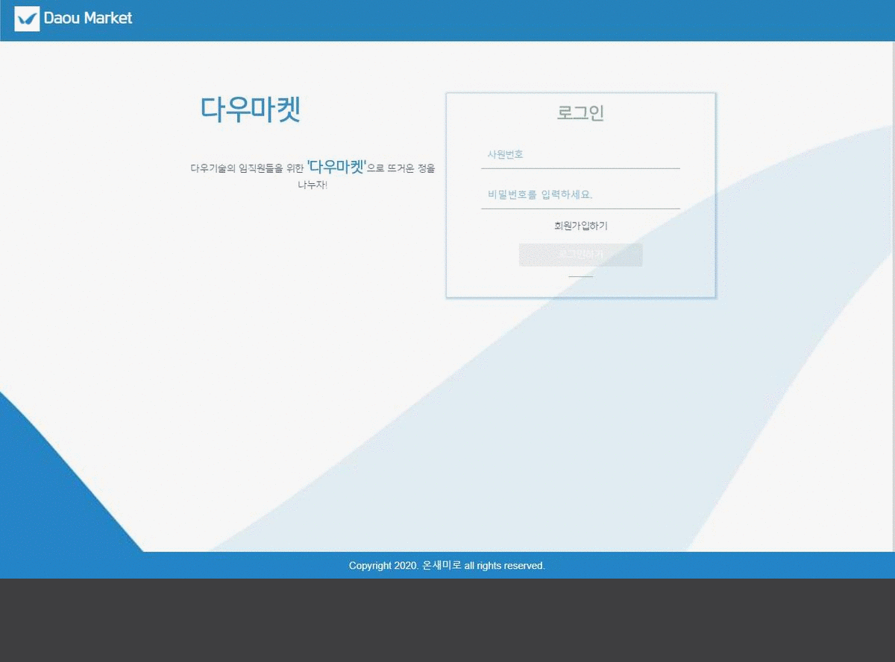
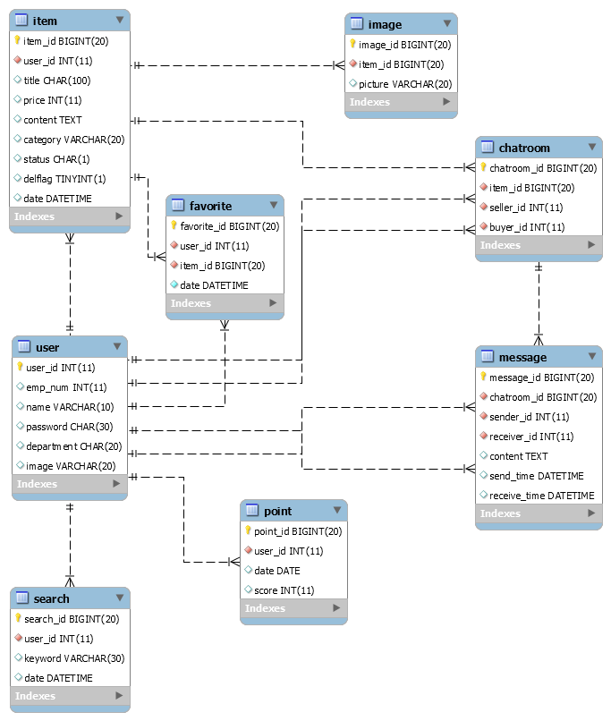

# 다우마켓 - 온새미로
## About DaouMarket



다우기술의 임직원들을 위한 '다우마켓'으로 뜨거운 정을 나누자!

현재 다우기술 포탈 사이트의 열린마당에서 공동구매나 구매하는 게시물을 보고 아이디어를 착안.

'이달의 다우인'이라는 기능으로 동기 부여를 함으로써 원활한 판매, 나눔이 가능하다고 예상됨.

#### 1) 기본에 충실(CRUD)

회원가입과 물건 등록 등 기본적인 CRUD를 바탕으로 기능들을 구현

#### 2) 이달의 다우인

판매를 많이 하거나 나눔을 많이한 임직원을 확인할 수 있음(추후 순위권에 있는 임직원들에게 소정의 선물 증정 가능)

#### 3) 1:1 대화(메신저)

판매자와 구매자 대화 기능 구현

## Team

- #### 김성민(90812)

  - 게시물(아이템)
  - 파일 업로드
  - 채팅

- #### 박재성(90815)

  - Front-End

- #### 배윤희(90818)

  - 유저
  - 이달의 다우인(랭킹)
  - 관심 목록(찜하기)


## Rule

- ##### Front-End  

  - ##### Vue.js

    - lowerCamelCase : 메소드, 변수  
    - UpperCamelCase : Vue

- ##### Back-End  

  - ##### Java  

    - lowerCamelCase : 변수, 메소드, 객체  
    - UpperCamelCase : 클래스명

- ##### Git (feature branch 단위)  

  ##### 첫 글자는 대문자를 사용하며, 마침표를 제외합니다. 

  - ##### Fix : 올바르지 않은 동작을 고친 경우에 사용합니다.  

    > Fix A  : A를 수정합니다.

    ```
    Fix login
    ```

  - ##### Add : 코드나 테스트, 예제, 문서 등의 추가가 있을 때 사용합니다.

    > Add A : A를 추가합니다.

    ```
    Add error pages
    ```

  - ##### Remove : 코드의 삭제가 있을 때 사용합니다.

    > Remove A : A를 삭제합니다.

    ```
    Remove unnecessary login code
    Remove sentences from README.md
    ```

  - ##### Refactor : 전면 수정이 있을 때 사용합니다.

    > Refactor A : A를 전면 수정합니다.

    ```
    Refactor argument validation
    Refactor login.XML
    ```

  - ##### Update : 개정이나 버전 업데이트가 있을 때 사용합니다. 코드보다는 주로 문서나 리소스, 라이브러리등에 사용합니다.

    > Update A to B : A를 B하기 위해 업데이트 합니다.

    ```
    Update repo docs to use HTTPS
    ```

  - ##### Rename : 이름 변경이 있을 때 사용합니다.

    > Rename A to B : A를 B로 이름 변경합니다.

    ```
    Rename login_info to loginInfo
    ```

## ERD



## Architecture


## Project Schedule

2020.09.21 ~ 2020.10.14
